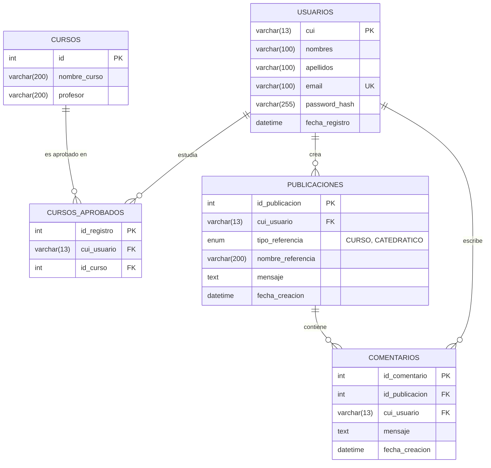

# Manual Técnico - ECYS Review Platform

Este documento proporciona una visión en profundidad de la arquitectura, tecnologías, funcionamiento interno y código de **ECYS Review Platform**. Está diseñado para futuros desarrolladores o ingenieros de software que deseen dar mantenimiento, escalar o estudiar la plataforma.

---

## 1. Tecnologías Utilizadas

El sistema fue desarrollado bajo una arquitectura **Monorepo**, consolidando de forma ordenada el Backend y Frontend del aplicativo, lo cual facilita la gestión de dependencias y el control de versiones.

### Frontend
*   **React + Vite:** Utilizado para construir una Single Page Application (SPA) extremadamente rápida.
*   **Enrutamiento:** `react-router-dom` maneja las vistas (Login, Registro, Recuperación, Home, Perfil).
*   **Estilos:** CSS Vanilla con diseño **Glassmorphism**, brindando transparencias y efectos de desenfoque.
*   **Peticiones HTTP:** Se construyó una instancia global de `axios` (`services/api.js`) para interceptar y adjuntar automáticamente los tokens de seguridad a cada petición.

### Backend
*   **Entorno:** Node.js v18+ y Express.js.
*   **Seguridad:** 
    *   `bcrypt`: Para el hasheo de contraseñas de una sola vía (Salt rounds: 10).
    *   `jsonwebtoken` (JWT): Para la autenticación *stateless*.
*   **Base de Datos:** TiDB Cloud Serverless (Compatible con MySQL).
    *   `mysql2/promise`: Librería para manejar consultas asíncronas con Promesas/Async-Await, previniendo el uso de callbacks anidados.

---

## 2. Arquitectura del Sistema

El flujo de información es estrictamente unidireccional (Cliente -> API -> Base de Datos). La API sirve como una capa protectora y mediadora.


---

## 3. Modelo Físico de Base de Datos (E-R)

A diferencia de un diagrama conceptual, este es el diagrama **Físico y Real** desplegado en TiDB. Nota cómo el concepto de "Perfil" en realidad se deriva lógicamente de los datos del `usuario` y sus `cursos_aprobados`, evitando así una tabla redundante.



---

## 4. Endpoints y Controladores (REST)

El backend expone módulos controlados que validan la entrada de datos.

### 4.1 Autenticación (`/api/auth`)
Encargada de generar accesos. Destaca la lógica de hasheo de contraseñas, por ejemplo, en `register`:
```javascript
// backend/controllers/authController.js
const hashedPassword = await bcrypt.hash(password, 10);
await db.query(
  'INSERT INTO usuarios (cui, nombres, apellidos, email, password_hash) VALUES (?, ?, ?, ?, ?)',
  [cui, nombres, apellidos, email, hashedPassword]
);
```

### 4.2 Lógica de Perfil Lógico (`/api/perfil`)
Aunque no existe una tabla perfil, el `perfilController.js` consolida la información usando los Cursos Aprobados:
*   `GET /:cui`: Retorna los detalles.
*   `POST /:cui/cursos-aprobados`: Vincula cursos aprobados al usuario.

### 4.3 Gestión del Feed (`/api/publicaciones` y `/api/comentarios`)
El controlador de publicaciones realiza búsquedas avanzadas y permite filtrar por `curso` o `catedratico` desde el Frontend. Cuando el Frontend hace GET, el Backend utiliza cláusulas `WHERE` condicionales:

```javascript
// backend/controllers/publicacionesController.js
let query = `
  SELECT p.*, u.nombres, u.apellidos
  FROM publicaciones p
  JOIN usuarios u ON p.cui_usuario = u.cui
  WHERE 1=1
`;
if (curso) query += ` AND p.nombre_referencia = ?`;
```

---

## 5. Implementación del Middleware de Seguridad

Todas las rutas sensibles están envueltas en el middleware `verifyToken.js`. El frontend adjunta el token en sus peticiones a través de la instancia de `axios`.

```mermaid
sequenceDiagram
    participant Cliente as Frontend (React + Axios)
    participant API as Express Router
    participant AuthMW as Middleware (verifyToken.js)
    participant DB as TiDB (Controladores)
    
    Cliente->>API: GET /api/publicaciones 
    Note right of Cliente: Headers: { Authorization: "Bearer xyz..." }
    API->>AuthMW: Ejecuta next() o bloquea
    AuthMW->>AuthMW: jwt.verify(token, process.env.JWT_SECRET)
    
    alt Firma Inválida o Expirado
        AuthMW-->>Cliente: 401/403 Unauthorized (Bloqueo)
    else Token Válido
        AuthMW->>API: Asigna req.user = payload; next()
        API->>DB: db.query(...)
        DB-->>API: RowDataPacket[]
        API-->>Cliente: 200 OK + JSON Response
    end
```

### Inyección de Axios (Frontend)
Para asegurar que toda la SPA se comunique con esta seguridad sin escribir el código mil veces, se diseñó la siguiente configuración en `frontend/src/services/api.js`:
```javascript
api.interceptors.request.use((config) => {
  const token = localStorage.getItem('token');
  if (token) {
    config.headers.Authorization = `Bearer ${token}`;
  }
  return config;
});
```

---

## 6. Recomendaciones para el Despliegue
- La Base de Datos (TiDB) ya está alojada en la nube por lo que no requiere instancias locales.
- **Backend:** Se recomienda usar PM2 para mantener los procesos activos (`pm2 start server.js`).
- **Frontend:** Se recomienda construir los assets estáticos usando `npm run build` y servirlos con Nginx o subirlos a plataformas como Vercel/Netlify.
