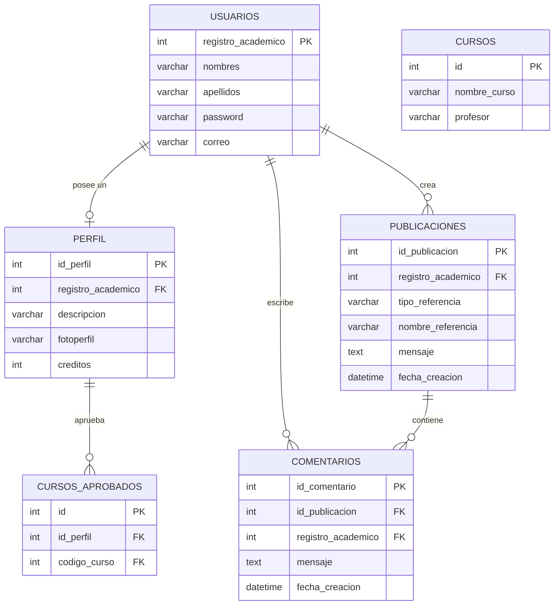
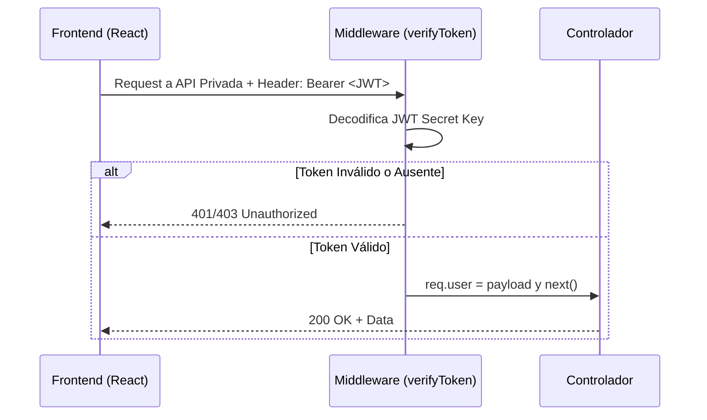

# Manual Técnico - ECYS Review Platform

Este documento proporciona una visión en profundidad de la arquitectura, tecnologías y funcionamiento interno de ECYS Review Platform. 

---

## 1. Tecnologías Utilizadas

El sistema fue desarrollado bajo una arquitectura **Monorepo** que consolida de forma ordenada el Backend y Frontend de la aplicación.

*   **Frontend:** Desarrollado con **React** bajo el entorno de **Vite**. Se utilizaron librerías modernas como `react-router-dom` para la navegación y `axios` para consumo de APIs. Estilos implementados en **CSS Vanilla** con un enfoque premium (Glassmorphism).
*   **Backend:** Construido con **Node.js** y **Express**. Para la seguridad, se utiliza `bcrypt` para encriptar contraseñas y `jsonwebtoken` para la autenticación sin estado (stateless).
*   **Base de Datos:** **TiDB MySQL Serverless Cloud** alojando toda la persistencia de los datos en la nube. Conexión gestionada mediante `mysql2/promise`.

---

## 2. Arquitectura del Sistema

La arquitectura sigue el modelo Cliente-Servidor separando las responsabilidades de UI y Lógica de Negocios de forma clara mediante peticiones RESTful.

---

## 3. Modelo de Base de Datos (Entidad-Relación)

La base de datos se normalizó para prevenir redundancia, contando con tablas de usuarios, perfiles, catálogos (cursos) y datos dinámicos (publicaciones, comentarios, cursos aprobados).

---

## 4. Endpoints de la API (REST)

El backend de Express expone las siguientes rutas modulares:

### 4.1 Autenticación (`/api/auth`)
*   `POST /register`: Encripta la contraseña y almacena el registro. Retorna JWT.
*   `POST /login`: Valida credenciales. Retorna JWT.
*   `POST /forgot-password`: Permite actualizar la contraseña basado en validación de registro académico.

### 4.2 Perfiles (`/api/perfil`)
*   `GET /:registro_academico`: Retorna los detalles del perfil del usuario (créditos, descripción).
*   `PUT /:registro_academico`: Actualiza parámetros del perfil y avatares.
*   `POST /:registro_academico/cursos-aprobados`: Vincula cursos aprobados al perfil.

### 4.3 Publicaciones (`/api/publicaciones`)
*   `POST /`: Crea una nueva publicación asignada al JWT extraído del middleware de autorización.
*   `GET /`: Obtiene el Feed completo. Admite Query Params (`?curso=...` y `?catedratico=...`) para la filtración desde Base de Datos.
*   `GET /:id/comentarios`: Consulta todos los comentarios vinculados a una publicación uniendo con la tabla usuarios (JOIN) para proveer nombres y apellidos de los autores.

### 4.4 Comentarios (`/api/comentarios`)
*   `POST /`: Registra el comentario hacia una publicación (`id_publicacion`) desde el usuario autorizado.

### 4.5 Cursos (`/api/cursos`)
*   `GET /`: Expone el catálogo estandarizado e inicializado por los scripts *seeder* (`seed-cursos.js`) de forma que el cliente web pueda renderizar y extraer listas de cursos y catedráticos para datalists de UI de manera dinámica.

---

## 5. Middleware y Seguridad

Todas las rutas privadas en el sistema interceptan las peticiones a través de `verifyToken.js`.

